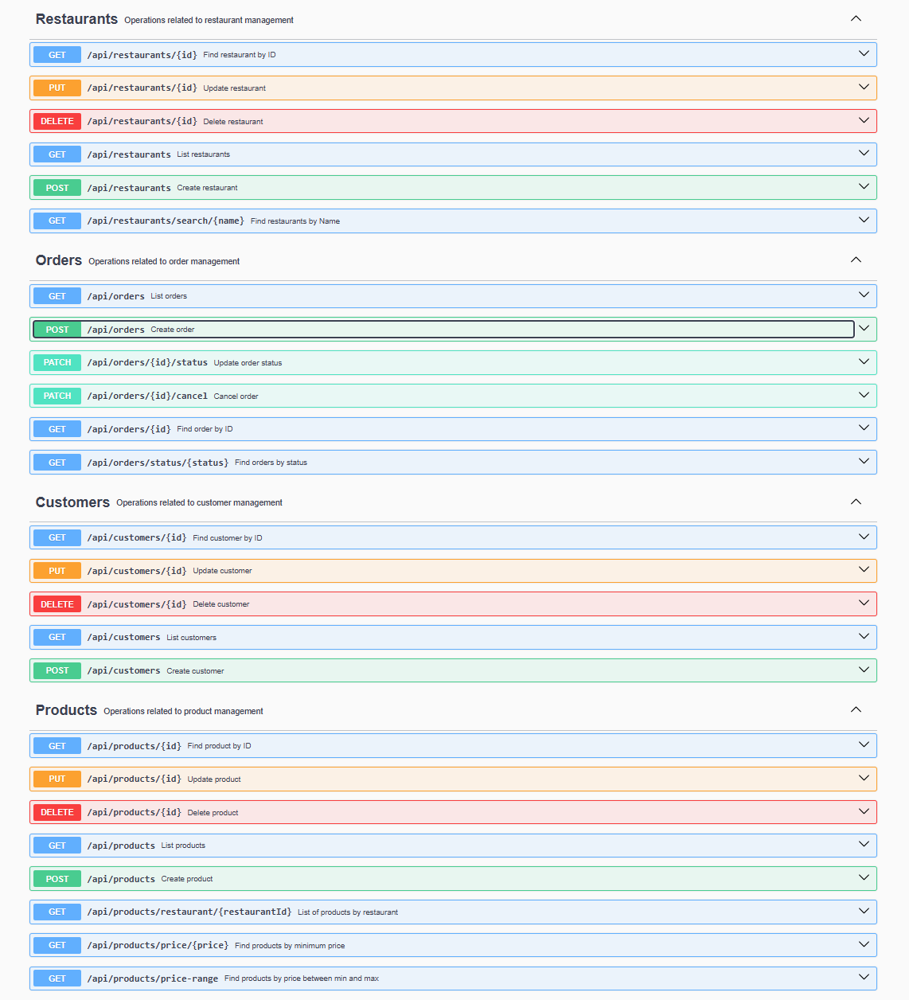
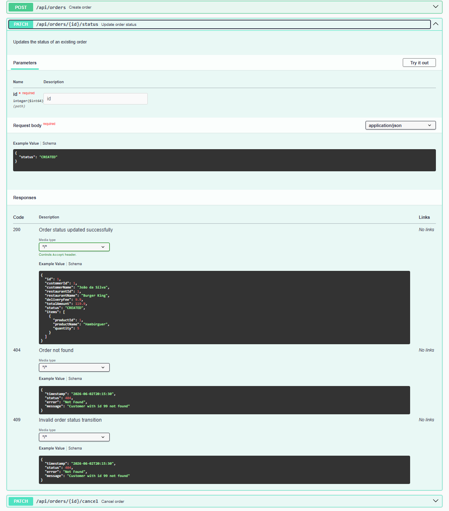

# Delivery Management API

API REST para gerenciamento de pedidos de delivery desenvolvida com Java, Spring Boot, PostgreSQL, testes automatizados e documentação OpenAPI.


## 📌 Sobre o Projeto

A Delivery Management API é uma aplicação REST desenvolvida com Java e Spring Boot para gerenciamento de pedidos de delivery.

O sistema permite o cadastro de clientes, restaurantes e produtos, além da criação e acompanhamento de pedidos, simulando funcionalidades presentes em plataformas de entrega de alimentos.

O projeto foi desenvolvido com foco em boas práticas de arquitetura, tratamento de exceções, documentação da API e testes automatizados.

---

## 🚀 Tecnologias Utilizadas

* Java 21
* Spring Boot 4.0.6
* Spring Data JPA
* Hibernate
* PostgreSQL
* Maven
* OpenAPI / Swagger
* JUnit 5
* Mockito
* MockMvc

---

## 🏗️ Arquitetura

O projeto segue uma arquitetura em camadas:

```text
Controller
│
Service
│
Repository
│
Database
```

### Camadas

**Controller**

* Recebe as requisições HTTP.
* Valida os dados de entrada.
* Retorna as respostas da API.

**Service**

* Contém as regras de negócio da aplicação.

**Repository**

* Responsável pela comunicação com o banco de dados através do Spring Data JPA.

**DTO**

* Responsável pela transferência de dados entre as camadas.

**Exception**

* Centraliza o tratamento de erros da aplicação.

---

## 📋 Funcionalidades

### Clientes

* Criar cliente
* Listar clientes
* Buscar cliente por ID
* Atualizar cliente
* Remover cliente

### Restaurantes

* Criar restaurante
* Listar restaurantes
* Buscar restaurante por ID
* Buscar restaurantes por nome
* Atualizar restaurante
* Remover restaurante

### Produtos

* Criar produto
* Listar produtos
* Buscar produto por ID
* Atualizar produto
* Remover produto
* Buscar produtos por restaurante

### Pedidos

* Criar pedido
* Listar pedidos
* Buscar pedido por ID
* Buscar pedidos por status
* Atualizar status do pedido
* Cancelar pedido

---

## 📦 Regras de Negócio

### Fluxo de Status do Pedido

Os pedidos seguem um fluxo controlado de estados:

```text
CREATED
↓
CONFIRMED
↓
PREPARING
↓
OUT_FOR_DELIVERY
↓
DELIVERED
```

Também existe o status:

```text
CANCELLED
```
utilizado quando um pedido é cancelado em um estágio permitido.

### Transições de Status

A aplicação valida todas as mudanças de status através de regras de negócio implementadas na camada de serviço.

Transições permitidas:

```text
CREATED → CONFIRMED

CONFIRMED → PREPARING

PREPARING → OUT_FOR_DELIVERY

OUT_FOR_DELIVERY → DELIVERED
```

Transições inválidas são bloqueadas e retornam erro de negócio.

Exemplos de transições não permitidas:

```text
CREATED → DELIVERED

CREATED → OUT_FOR_DELIVERY

CONFIRMED → DELIVERED

DELIVERED → CREATED
```

### Cancelamento de Pedidos

Um pedido pode ser cancelado apenas enquanto estiver nos status:

```text
CREATED
CONFIRMED
```

Pedidos nos status:

```text
PREPARING
OUT_FOR_DELIVERY
DELIVERED
```

não podem ser cancelados.

Tentativas de cancelamento inválidas retornam erro de negócio.

### Validações

* Nome do cliente é obrigatório.
* E-mail deve possuir formato válido.
* Taxa de entrega não pode ser negativa.
* Pedidos devem possuir pelo menos um item.
* Produtos devem estar associados a um restaurante válido.
* Transições inválidas de status são bloqueadas.

---

## 🔗 Principais Endpoints

### Clientes

| Método | Endpoint            |
| ------ | ------------------- |
| POST   | /api/customers      |
| GET    | /api/customers      |
| GET    | /api/customers/{id} |
| PUT    | /api/customers/{id} |
| DELETE | /api/customers/{id} |

### Restaurantes

| Método | Endpoint                       |
| ------ | ------------------------------ |
| POST   | /api/restaurants               |
| GET    | /api/restaurants               |
| GET    | /api/restaurants/{id}          |
| GET    | /api/restaurants/search/{name} |
| PUT    | /api/restaurants/{id}          |
| DELETE | /api/restaurants/{id}          |

### Produtos

| Método | Endpoint                                |
| ------ | --------------------------------------- |
| POST   | /api/products                           |
| GET    | /api/products                           |
| GET    | /api/products/{id}                      |
| GET    | /api/products/restaurant/{restaurantId} |
| GET    | /api/products/price/{price}             |
| GET    | /api/products/price-range               |
| PUT    | /api/products/{id}                      |
| DELETE | /api/products/{id}                      |

### Pedidos

| Método | Endpoint                    |
| ------ | --------------------------- |
| POST   | /api/orders                 |
| GET    | /api/orders                 |
| GET    | /api/orders/{id}            |
| GET    | /api/orders/status/{status} |
| PATCH  | /api/orders/{id}/status     |
| PATCH  | /api/orders/{id}/cancel     |

---

## 📨 Exemplos de Requisição

### Criar Cliente

```json
{
  "name": "Marcelo",
  "email": "marcelo@email.com"
}
```

### Criar Restaurante

```json
{
  "name": "Burger King",
  "category": "Fast Food",
  "deliveryFee": 9.90
}
```

### Criar Produto

```json
{
  "name": "Whopper",
  "price": 39.90,
  "restaurantId": 1
}
```

### Criar Pedido

```json
{
  "customerId": 1,
  "restaurantId": 1,
  "items": [
    {
      "productId": 1,
      "quantity": 2
    }
  ]
}
```

### Atualizar Status do Pedido

```json
{
  "status": "CONFIRMED"
}
```

---

## ⚠️ Tratamento de Erros

A API utiliza tratamento global de exceções através de um GlobalExceptionHandler.

Exemplo de resposta:

```json
{
  "timestamp": "2026-06-12T18:00:00",
  "status": 404,
  "error": "Customer not found"
}
```

---

## 🧪 Testes

### Testes Unitários

* ProductServiceTest
* OrderServiceTest

### Testes de Integração

* HealthControllerIntegrationTest
* CustomerControllerIntegrationTest
* RestaurantControllerIntegrationTest
* ProductControllerIntegrationTest
* OrderControllerIntegrationTest

Os testes utilizam:

* JUnit 5
* Mockito
* Spring Boot Test
* MockMvc

Executar todos os testes:

```bash
.\mvnw clean test
```

---

## 📖 Documentação Swagger

A documentação interativa da API está disponível após iniciar a aplicação:

```text
http://localhost:8080/swagger-ui/index.html
```

### Visão Geral da API



### Exemplo de Endpoint

Abaixo é possível visualizar a documentação do endpoint de atualização de status de pedidos.



---

### Clonar o projeto

```bash
git clone https://github.com/MarceloJustin/delivery-management-api.git

cd delivery-management-api
```

## ▶️ Executando o Projeto

### 1. Criar o banco de dados

```sql
CREATE DATABASE delivery_management_db;
```

### 2. Configurar o application.properties

Defina as credenciais do PostgreSQL.

### 3. Executar a aplicação

```bash
.\mvnw spring-boot:run
```

---

## 🔮 Melhorias Futuras

* Docker
* Docker Compose
* Integração contínua com GitHub Actions
* Spring Security
* Autenticação e autorização
* Versionamento da API
* Fluxo de pagamento dos pedidos

---

## 👨‍💻 Autor

Desenvolvido por **Marcelo da Silva Justin** como projeto de estudo e prática de desenvolvimento backend utilizando Java e Spring Boot.

GitHub: https://github.com/MarceloJustin         
LinkedIn: https://linkedin.com/in/marcelojustin

---

## 📄 Licença

Este projeto está licenciado sob a licença MIT.

Consulte o arquivo LICENSE para mais informações.